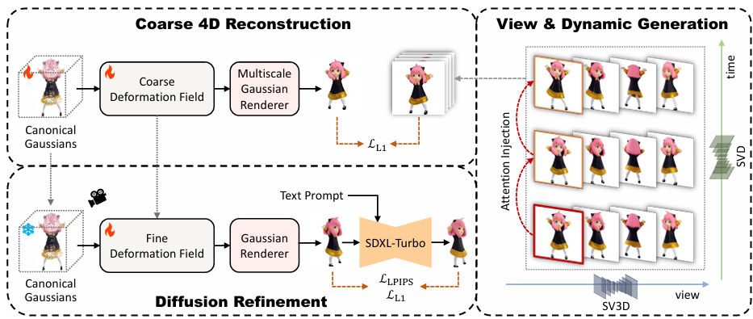

# EG4D: Explicit Generation of 4D Object without Score Distillation (ICLR 2025)



> **EG4D: Explicit Generation of 4D Object without Score Distillation**
>
> Qi Sun∗, Zhiyang Guo∗, Ziyu Wan, Jing Nathan Yan, Shengming Yin, Wengang Zhou, Jing Liao, Houqiang Li

<a href='https://arxiv.org/abs/2405.18132v1'>

## News
+ 2025.2.14: Code released!
+ 2025.1.23: Accepted by ICLR 2025!
+ 2024.5.28: Released on the arXiv!

## Installation

```bash
git clone https://github.com/jasongzy/eg4d --recursive
conda create -n eg4d python=3.10 
conda activate eg4d

conda install pytorch==2.0.1 torchvision==0.15.2 torchaudio==2.0.2 pytorch-cuda=11.8 -c pytorch -c nvidia
pip install -r requirements.txt

# install customized modules
pip install -e ./submodules/generative-models
pip install -e ./submodules/diffusers
```

## Usage

### Stage I: View & Dynamic Generation

Download SVD-XL checkpoint from <https://huggingface.co/stabilityai/stable-video-diffusion-img2vid-xt-1-1> to `./submodules/generative-models/checkpoints/svd_xt_1_1.safetensors`.

Download SV3D checkpoint from <https://huggingface.co/stabilityai/sv3d> to `./submodules/generative-models/checkpoints/sv3d_p.safetensors`.

```bash
name=luigi
cd ./submodules/generative-models
python scripts/sampling/simple_video_sample.py --version svd_xt --resize \
    --input_path data/images/luigi.png --output_name ${name}
cd ../..
python prepare_dataset.py --video_path ./submodules/generative-models/outputs/simple_video_sample/svd_xt/${name}.mp4 \
    --output_dir data/${name} --ref --ref_ema --ref_strength 0.5
```

### Stage II: Coarse 4D Reconstruction

```bash
name=luigi
python train.py \
    -s ../data/${name}/multiviews \
    --configs arguments/sv4d.py \
    --expname ${name}-coarse \
    --low_res_train
```

### Stage III: Diffusion Refinement

```bash
name=luigi
python train_refine.py \
    -s ./data/${name}/multiviews \
    --configs arguments/sv4d_refine.py \
    --expname ${name}-refine \
    --start_checkpoint path\to\stage2\ckpts \
    --do
```

## Citation

```bibtex
@inproceedings{sun2024eg4d,
  title={EG4D: Explicit Generation of 4D Object without Score Distillation},
  author={Qi Sun and Zhiyang Guo and Ziyu Wan and Jing Nathan Yan and Shengming Yin and Wengang Zhou and Jing Liao and Houqiang Li},
  booktitle={ICLR},
  year={2025}
}